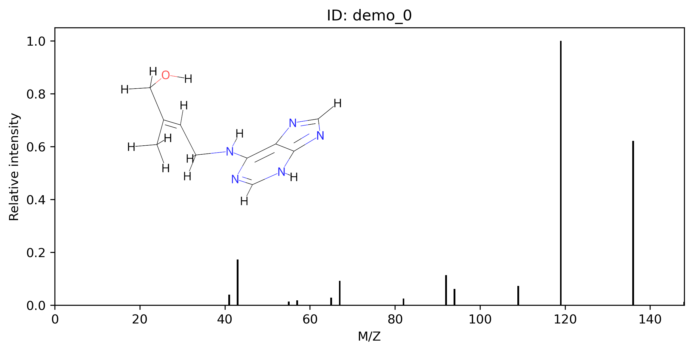

# 3DMolMS

[![CC BY-NC-SA 4.0][cc-by-nc-sa-shield]][cc-by-nc-sa] (free for academic use) 

**3D** **Mol**ecular Network for **M**ass **S**pectra Prediction (3DMolMS) is a deep neural network model to predict the MS/MS spectra of compounds from their 3D conformations. This model's molecular representation, learned through MS/MS prediction tasks, can be further applied to enhance performance in other molecular-related tasks, such as predicting retention times and collision cross sections. 

[Read our paper in Bioinformatics](https://academic.oup.com/bioinformatics/article/39/6/btad354/7186501) | [Try our online service at GNPS](https://spectrumprediction.gnps2.org) | [Install from PyPI](https://pypi.org/project/molnetpack/1.1.0/)


## Installation

3DMolMS is available on PyPI. You can install the latest version using `pip`:

```bash
pip install molnetpack

# PyTorch must be installed separately. 
# For CUDA 11.6, install PyTorch with the following command:
pip install torch==1.13.0+cu116 torchvision==0.14.0+cu116 torchaudio==0.13.0 --extra-index-url https://download.pytorch.org/whl/cu116

# For CUDA 11.7, use:
pip install torch==1.13.0+cu117 torchvision==0.14.0+cu117 torchaudio==0.13.0 --extra-index-url https://download.pytorch.org/whl/cu117

# For CPU-only usage, use:
pip install torch==1.13.0+cpu torchvision==0.14.0+cpu torchaudio==0.13.0 --extra-index-url https://download.pytorch.org/whl/cpu
```


## Usage

To get started quickly, you can load a CSV or MGF file to predict MS/MS and then plot the predicted results:

```python
import torch
from molnetpack import MolNet

# Set the device to CPU for CPU-only usage:
device = torch.device("cpu")

# For GPU usage, set the device as follows (replace '0' with your desired GPU index):
# gpu_index = 0
# device = torch.device(f"cuda:{gpu_index}")

# Instantiate a MolNet object
molnet_engine = MolNet(device, seed=42) # The random seed can be any integer. 

# Load data (here we use a CSV file as an example)
molnet_engine.load_data(path_to_test_data='./test/demo_input.csv')
# molnet_engine.load_data(path_to_test_data='./test/demo_input.mgf') # MGF file is also supported

# Predict MS/MS
spectra = molnet_engine.pred_msms(path_to_results='./test/demo_msms.mgf')

# Plot the predicted MS/MS with 3D molecular conformation
molnet_engine.plot_msms(dir_to_img='./img/')
```

Please note that unsupported input data will be automatically filtered out during the data loading process. The table below shows the supported inputs: 

| Item             | Supported input                                               |
|------------------|---------------------------------------------------------------|
| Atom number      | <=300                                                         |
| Atom types       | 'C', 'O', 'N', 'H', 'P', 'S', 'F', 'Cl', 'B', 'Br', 'I', 'Na' |
| Precursor types  | '[M+H]+', '[M-H]-', '[M+H-H2O]+', '[M+Na]+'                   |
| Collision energy | any number                                                    |

Here is an example of predicted MS/MS plot. 

<p align="center">
  
</p> 

The documents for running MS/MS prediction from source codes are at [MSMS_PRED.md](docs/MSMS_PRED.md). 


## Train your own model

**Step 0**: Clone the Repository and Set Up the Environment

Clone the 3DMolMS repository and install the required packages using the following commands:

```bash
git clone https://github.com/JosieHong/3DMolMS.git
cd 3DMolMS

pip install .
```

**Step 1**: Obtain the Pretrained Model

Download the pretrained model (`molnet_pre_etkdgv3.pt.zip`) from [Google Drive](https://drive.google.com/drive/folders/1fWx3d8vCPQi-U-obJ3kVL3XiRh75x5Ce?usp=drive_link) or train the model yourself. For details on pretraining the model on the [QM9](https://figshare.com/collections/Quantum_chemistry_structures_and_properties_of_134_kilo_molecules/978904) dataset, refer to [PRETRAIN.md](docs/PRETRAIN.md).

**Step 2**: Prepare the Datasets

Download and organize the datasets into the `./data/` directory. The current version uses four datasets:

1. Agilent DPCL, provided by [Agilent Technologies](https://www.agilent.com/).
2. [NIST20](https://www.nist.gov/programs-projects/nist23-updates-nist-tandem-and-electron-ionization-spectral-libraries), available under license for academic use.
3. [MoNA](https://mona.fiehnlab.ucdavis.edu/downloads), publicly available.
4. Waters QTOF, our own experimental dataset.

The data directory structure should look like this:

```plaintext
|- data
  |- origin
    |- Agilent_Combined.sdf
    |- Agilent_Metlin.sdf
    |- hr_msms_nist.SDF
    |- MoNA-export-All_LC-MS-MS_QTOF.sdf
    |- MoNA-export-All_LC-MS-MS_Orbitrap.sdf
    |- waters_qtof.mgf
```

**Step 3**: Preprocess the Datasets

Run the following commands to preprocess the datasets. Specify the dataset with `--dataset` and select the instrument type as `qtof`. Use `--maxmin_pick` to apply the MaxMin algorithm for selecting training molecules; otherwise, selection will be random. The dataset configurations are in `./src/molnetpack/config/preprocess_etkdgv3.yml`.

```bash
python ./src/scripts/preprocess.py --dataset agilent nist mona waters \
--instrument_type qtof \
--data_config_path ./src/molnetpack/config/preprocess_etkdgv3.yml \
--mgf_dir ./data/mgf_debug/
```

**Step 4**: Train the Model

Use the following commands to train the model. Configuration settings for the model and training process are located in `./src/molnetpack/config/molnet.yml`.

```bash
python ./src/scripts/train.py --train_data ./data/qtof_etkdgv3_train.pkl \
--test_data ./data/qtof_etkdgv3_test.pkl \
--model_config_path ./src/molnetpack/config/molnet.yml \
--data_config_path ./src/molnetpack/config/preprocess_etkdgv3.yml \
--checkpoint_path ./check_point/molnet_qtof_etkdgv3.pt \
--transfer --resume_path ./check_point/molnet_pre_etkdgv3.pt
```

**Additional application**

3DMolMS is also capable of predicting molecular properties and generating reference libraries for molecular identification. Examples of such applications include retention time prediction and collision cross-section prediction. For more details, refer to [PROP_PRED.md](docs/PROP_PRED.md) and [GEN_REFER_LIB.md](docs/GEN_REFER_LIB.md) respectively. 


## Citation

If you use 3DMolMS in your research, please cite our paper:

```
@article{hong20233dmolms,
  title={3DMolMS: prediction of tandem mass spectra from 3D molecular conformations},
  author={Hong, Yuhui and Li, Sujun and Welch, Christopher J and Tichy, Shane and Ye, Yuzhen and Tang, Haixu},
  journal={Bioinformatics},
  volume={39},
  number={6},
  pages={btad354},
  year={2023},
  publisher={Oxford University Press}
}
```

Thank you for considering 3DMolMS for your research needs!

## License

This work is licensed under a
[Creative Commons Attribution-NonCommercial-ShareAlike 4.0 International License][cc-by-nc-sa].

[![CC BY-NC-SA 4.0][cc-by-nc-sa-image]][cc-by-nc-sa]

[cc-by-nc-sa]: http://creativecommons.org/licenses/by-nc-sa/4.0/
[cc-by-nc-sa-image]: https://licensebuttons.net/l/by-nc-sa/4.0/88x31.png
[cc-by-nc-sa-shield]: https://img.shields.io/badge/License-CC%20BY--NC--SA%204.0-lightgrey.svg